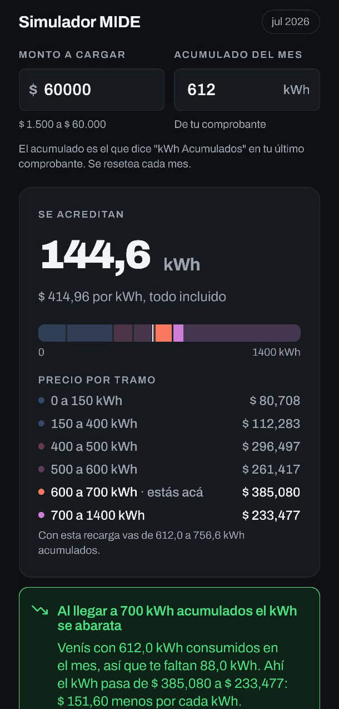

# Simulador de consumo MIDE (Edenor)

Simulador del sistema prepago **MIDE** de Edenor: calcula cuántos kWh acredita una
recarga, según los tramos de precio que atraviese tu consumo acumulado del mes y los
impuestos que salen del monto.

La pregunta que busca responder no es "cuánto sale el kWh", sino:

> ¿Cuántos kWh me da $50.000 **hoy**?

<p align="center">
  <strong><a href="https://simulador-mide.vercel.app/">→ Probala en el navegador</a></strong>
</p>

<p align="center">
  
</p>

<p align="center">
  <em>
    Una recarga de $60.000 con 612 kWh acumulados. La barra es la escalera de precios: los
    segmentos van a escala de los kWh que abarca cada tramo y el color sale del precio, no
    del orden.
  </em>
</p>

> [!IMPORTANT]
> Proyecto personal, **sin relación ni afiliación con Edenor ni con el ENRE**. No es
> la aplicación oficial de MIDE.

## Estado

Prototipo funcional. Lo que hay hoy:

- **Motor de cálculo** (`app/domain/`): lógica pura en TypeScript, sin dependencias de
  React Native. Reproduce **11 comprobantes reales** de 7 períodos tarifarios distintos.
- **Precios derivados del cuadro tarifario T1-R del ENRE**, no copiados de los tickets.
  Los comprobantes son el set de validación.
- **Calculadora de recarga**: se ingresa el monto y el consumo acumulado del mes, y se
  ven los kWh que se acreditan con el mismo desglose que imprime el ticket, renglón por
  renglón. La recarga está acotada a los límites de MIDE, entre $1.500 y $60.000.
- **La escalera, dibujada**: dónde cae el acumulado del mes, hasta dónde lo lleva la recarga
  y qué precio tiene cada tramo, más un aviso de cuánto falta para el próximo cambio de
  precio y si ese cambio abarata o encarece el kWh. Tema claro y oscuro.
- **Scraper** de los cuadros del ENRE (`scraper/`, Python con `uv`): baja los cuadros T1-R de
  Edenor y los emite como JSON, que es lo que el motor lee. Tiene cargados 28 períodos
  (abr/2024 a jul/2026) y ya no hace falta transcribir tarifas a mano.
- **Versión web** en [simulador-mide.vercel.app](https://simulador-mide.vercel.app/): el
  mismo código que el APK, exportado con `expo export`. Lo único que cambia es que los
  plegables no animan, porque `LayoutAnimation` es no-op en el navegador.
- **Sin backend**, y no hace falta: ver [más abajo](#por-qué-no-hay-backend).

## El problema

En MIDE no hay factura: se recarga un monto, el medidor acredita kWh y cuando llegan a
cero se corta el servicio. Tres cosas hacen la cuenta poco intuitiva:

**1. El monto que recargás es bruto.** Los impuestos salen de arriba y solo el resto
compra energía. Hay además una "Tasa Municipal" que también sale del monto:

```
Subtotal A (energía) + Subtotal B (impuestos) + Tasa Municipal = COMPRA ACTUAL
```

De cada $100 que cargás, unos $78,50 compran kWh.

**2. El precio se cobra en escalera** sobre el consumo acumulado del mes, que se resetea
todos los meses. Una recarga que cruza un tope se parte y el ticket imprime un renglón
por tramo. Los topes son **150 / 400 / 500 / 600 / 700 / 1400 kWh**.

**3. La escalera no es monótona.** Sube hasta los 700 kWh y después baja fuerte:

| Tramo (2026-07) | $/kWh   |
| --------------- | ------- |
| ≤150            | 80,708  |
| ≤400            | 112,283 |
| ≤500            | 296,497 |
| ≤600            | 261,417 |
| ≤700            | 385,080 |
| ≤1400           | 233,477 |

O sea que **cruzar los 700 kWh acumulados abarata el kWh**, no lo encarece. La causa está
en el punto siguiente.

Es lo que se ve en la captura de arriba: el tramo ≤700 es el más cálido de la barra por ser
el más caro, y el ≤1400 vuelve a un tono frío. Por eso el color de cada tramo se interpola
del precio y no del índice — pintar por orden mostraría el tramo más barato como el más caro.

## Cómo funciona el cálculo

Los precios de la escalera no son un dato del ticket: se **derivan** del cuadro tarifario
T1-R que publica el ENRE. La regla es el costo marginal de la factura que MIDE no emite,
entre topes de bloque:

```
Costo(C) = cargoFijo(bloque) + varBase × mín(C, consumoBase)
                             + varExcedente × máx(0, C − consumoBase)

precio(tramo) = [Costo(tope) − Costo(topeAnterior)] / (tope − topeAnterior)
```

Ahí está la explicación de la escalera no monótona: el cargo fijo del cuadro salta mucho
entre bloques (en 2026-07 va de $3.648 a $11.981 a $40.400), y al repartirse sobre 100 kWh
de ancho infla el precio de los tramos del medio. En el ≤1400 se reparte sobre 700 kWh, y
por eso vuelve a bajar.

El `consumoBase` es estacional: 300 kWh en dic-feb y may-ago, 150 kWh en mar-abr y sep-nov.
El régimen anterior a 2026 usaba 350 fijo. Ese parámetro es el que explica que el tramo
≤400 casi se duplicara entre dic/25 y mar/26.

Sobre la energía se aplican los impuestos, y por debajo de los 600 kWh acumulados se suma
la tasa municipal por kWh. **No hay cargo fijo cobrado aparte**: en los comprobantes los
subtotales C y D son siempre cero — está prorrateado dentro de los precios.

### Verificación

La derivación se validó contra **17 tramos de 7 períodos** y tres regímenes de consumo
base distintos. Los precios coinciden con los impresos dentro del último dígito que el
ticket muestra (el milésimo), y también coinciden los importes en pesos de cada renglón:

```
Ticket 58348 (dic/25), renglón 1:  150,0 kWh × $61,675 = $9.251,25
Fórmula:                           1.383,00 + 52,455 × 150 = $9.251,25
```

> [!NOTE]
> Lo único que queda sin resolver es el tramo de **arriba de 1400 kWh**. El cuadro publica
> el último bloque como "+700" sin techo, y MIDE lo trata como si el tope fuera 1400 —así
> lo imprime el ticket—, pero ningún comprobante cruzó ese acumulado (el más alto visto es
> 1336,8). Con un acumulado mayor la app **falla a propósito** en vez de extrapolar.
>
> La otra pieza no verificada es la **tasa municipal**, que el ENRE no publica porque es un
> cargo del municipio: solo se conoce por los tickets, y el período vigente no tiene
> ninguno que la confirme. La app avisa cuando la está heredando de un período anterior.

Los documentos [`docs/calculoKWH.md`](docs/calculoKWH.md) y
[`docs/implementaciones.md`](docs/implementaciones.md) describen modelos anteriores —tramos
progresivos primero, categorías con cargo fijo después— que los comprobantes desmintieron.
Se conservan como registro del razonamiento; no son especificación. La historia de cómo se
llegó al modelo vigente está en [`docs/bitacora.md`](docs/bitacora.md), y el producto en
[`docs/idea.md`](docs/idea.md).

## Estructura

```
├── app/                  frontend React Native + Expo (TypeScript strict)
│   ├── domain/           motor de cálculo — TypeScript puro, testeable aislado
│   │   ├── types.ts         CuadroEnre, TarifaMide, ResultadoRecarga
│   │   ├── cuadrosEnre.json cuadros T1-R del ENRE — lo genera el scraper, no editar
│   │   ├── cuadrosEnre.ts   carga el JSON y lo filtra a Edenor N2
│   │   ├── tarifas.ts       costoFactura(), precioTramo() — la derivación
│   │   ├── calculadora.ts   calcularRecarga(), proximidadAlSalto(), montoParaKwh()
│   │   └── casos.ts         12 comprobantes reales + casos estructurales
│   ├── screens/          pantallas (calculadora de carga)
│   ├── ui/               tokens visuales y componentes (tema, escalera, plegables)
│   └── store/            estado (zustand) y validación (zod)
├── scraper/              baja los cuadros del ENRE (Python + uv)
└── docs/                 documentación de producto y del modelo de cálculo
```

El MVP calcula **100% en el cliente**, con los cuadros embebidos: la app funciona sin
conexión y no depende de ningún servicio.

```
Scraper (Python) → app/domain/cuadrosEnre.json → motor → pantalla
```

Los cuadros salen del índice público del ENRE
(`enre.gov.ar/web/tarifasd.nsf/todoscuadros?openview`), un documento por período. Ver
[`scraper/README.md`](scraper/README.md) — los cuadros cambiaron de formato en febrero 2026 y
el scraper maneja los dos.

### Por qué no hay backend

Hubo un scaffold de Go + Gin, eliminado porque nunca tuvo un propósito que sobreviviera al
contacto con el resto. Servía `/health` y su razón declarada era ofrecer una API de tarifas,
que es justo lo que resolvió el scraper emitiendo un JSON embebido.

Nada de lo planeado necesita servidor: el historial de cargas es almacenamiento local y los
avisos de consumo se hacen con notificaciones locales, porque el cálculo corre en el
dispositivo.

Tampoco lo necesita la pieza que sí falta. Como las tarifas cambian todos los meses, un JSON
embebido en el APK obligaría a un release mensual en Play Store, y los usuarios que no
actualizan calcularían con precios viejos: un mes de atraso en el tramo ≤1400 son 9,6 kWh de
error en una recarga de $60.000. La solución prevista es un **GitHub Action con cron** que
corra el scraper y commitee el JSON, con la app leyéndolo, cacheándolo y usando el embebido
como fallback offline. Sin hosting.

Ese diseño tiene además una ventaja sobre scrapear el ENRE desde la app: si el ENRE cambia su
HTML, se arregla el scraper y todos los usuarios se benefician **sin republicar**.

Un backend recién tendría sentido con features que necesiten estado compartido — cuentas,
sincronización entre dispositivos, notificaciones push reales. Si aparece alguna, el scaffold
que había está en la historia de git.

## Correrlo

Frontend:

```bash
cd app
pnpm install
pnpm start        # o: pnpm android / pnpm web
```

El motor de cálculo se puede ejercitar sin levantar la app:

```bash
cd app
npx tsc --noEmit          # typecheck
npx tsx domain/casos.ts   # corre los casos de prueba
```

Scraper de los cuadros (no hace falta para usar la app):

```bash
uv run scraper/main.py            # trae el último cuadro publicado
uv run scraper/main.py --check    # valida los parsers contra valores verificados
```

## Roadmap

- ~~**Actualización remota**~~ — **hecha**: un GitHub Action con cron corre el scraper y
  commitea el JSON, y la app lo baja al arrancar, lo valida, lo cachea y cae al embebido si
  falla. Las tarifas nuevas llegan sin publicar en Play Store. Detalle en
  [`docs/actualizacion-remota.md`](docs/actualizacion-remota.md).
- **El tramo de arriba de 1400 kWh**, lo único que el motor no sabe calcular. Hace falta un
  comprobante de una recarga hecha con ese acumulado.
- **Confirmar la tasa municipal del período vigente** con un comprobante que compre por
  debajo de 600 kWh acumulados.
- **Niveles N1 y N3**: el scraper ya los baja y la derivación los cubre. Falta poder elegir el
  nivel en la pantalla. Ojo: N3 dejó de publicarse en los cuadros desde febrero 2026.
- Simulación temporal: cuánto duran los kWh según el ritmo de consumo, y avisar cuándo
  conviene esperar antes de recargar.

## Licencia

[Apache 2.0](LICENSE).
